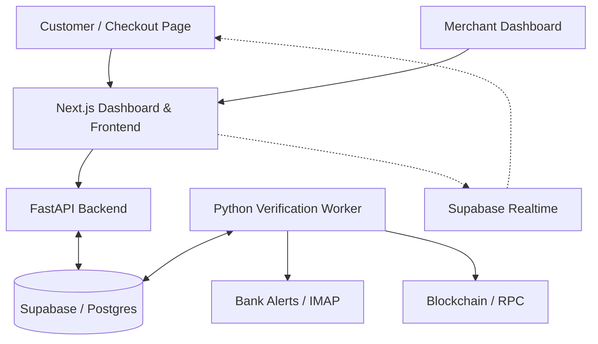

# 🌌 NoxPay

**Sovereign SaaS UPI & Crypto Payment Gateway**

[](https://John-Varghese-EH.github.io/NoxPay/)
[](https://github.com/John-Varghese-EH/NoxPay)

NoxPay is an open-source, self-hosted payment solution designed for Indian merchants and global businesses. Protect your sovereignty, minimize fees, and automate your settlement workflows for both UPI and Crypto.

<div align="center">
  
  <h3><b>The Ultimate Self-Hosted UPI & Crypto Checkouts</b></h3>
  <p>Eliminate middleman fees. Retain 100% of your revenue. Deploy your own payment infrastructure in minutes.</p>

  [](https://vercel.com/)
  [](https://supabase.com/)
  [](https://nextjs.org/)
  [](https://fastapi.tiangolo.org/)
</div>

---

## 🏗️ Architecture

NoxPay is built with a distributed architecture to ensure scalability and security.



## 📁 Project Structure

| Folder | Description |
| :--- | :--- |
| `api/` | FastAPI backend handling payment intents, webhooks, and merchant logic. |
| `dashboard/` | Next.js frontend for merchants and the hosted checkout pages. |
| `worker/` | Python background worker that verifies transactions (UPI & Crypto). |
| `supabase/` | Database schema and migrations. |

---

## ⚡ Core Features

NoxPay is designed to give you the same high-end experience, but without the 3% transaction fees.

### 💳 Modern Checkout Experience
- **Live QR Codes**: Instant scannable UPI and Crypto QR codes generated on-the-fly.
- **Real-time Status Polling**: The checkout page automatically redirects to "Success" the moment funds are verified via websockets (Supabase Realtime).
- [x] **Live Expiry Timers**: Precise MM:SS countdowns on every checkout link to create urgency and ensure fresh pricing.
- [x] **Multi-Language Support**: One-click toggle between English and Hindi on checkout pages to reach a broader audience.
- [x] **Embeddable Widget**: A clean, iframe-optimized checkout flow (`/widget`) you can drop into any website.

### 🛠️ Merchant Dashboard
- **No-Code Payment Links**: Create and share checkouts instantly via a simple form. No API knowledge required.
- **Branding Live Preview**: See exactly how your checkout looks as you customize your brand color and logo on the Settings page.
- **Webhook Observability**: Track every webhook delivery, view response codes, and manually "Retry" failed deliveries with one click.
- **Persistent Webhook Retries**: Automatic background retry logic with exponential backoff for failed webhook deliveries.
- **Crypto Tab**: Dedicated space for tracking USDT (TRC20) and Crypto payments with a live transaction feed.
- **Transaction Metadata**: Attach custom JSON metadata to any payment intent, which is preserved throughout the payment lifecycle and included in webhooks.

---

## 🔒 Security Infrastructure

Security isn't an afterthought; it's the foundation of NoxPay.

- **HMAC-SHA256 Webhooks**: Every webhook is cryptographically signed. NoxPay uses a dedicated `webhook_secret` distinct from your API keys.
- **Replay Protection**: Timestamps are included in all signatures to prevent payload interception and re-use.
- **bcrypt API Secrets**: Your Client Secrets are hashed using industry-standard bcrypt. Even if the database is compromised, your secrets remain unreadable.
- **Row-Level Security (RLS)**: Every database query is restricted to the authenticated merchant at the Postgres level.
- **Identity Verification**: Background workers verify bank alerts against specific transaction notes to prevent UTR spoofing.

---

## 🎨 Professional Customization

NoxPay gives you total control over your brand identity:

1. **Brand Identity**: Upload your logo and set your primary theme color.
2. **Interactive Preview**: Use the real-time preview widget in Settings to see your branding across Desktop and Mobile views instantly.
3. **Theme Presets**: Choose from curated professional palettes like *Midnight Blue, Emerald Green, or Rose Crush*.
4. **Custom Return URLs**: Define exactly where users go after a successful payment attempt.

---

## 🌍 International Payments (Crypto)

**Can I accept international payments for free?**
Yes. Traditional gateways (Stripe/PayPal) charge 4-7% for international transactions. NoxPay solves this via **USDT (Crypto) Integration**.

- **Sovereign Settlement**: By using the USDT (TRC20) payment method in NoxPay, you can accept payments from anyone, anywhere in the world, instantly.
- **$0 Gateway Fees**: You pay zero percentage to NoxPay. You only deal with standard blockchain network gas fees (usually <$1).
- **Zero Chargebacks**: Unlike credit cards, crypto payments are final, protecting you from international fraud and disputes.

---

## 🛠️ Installation & Setup

### 📋 Prerequisites
- **Node.js** (v18+)
- **Python** (v3.9+)
- **Supabase Account** (Free tier works perfectly)
- **Vercel CLI** (Optional, for easy deployment)

### 💻 Local Development

1. **Clone the Repository**
   ```bash
   git clone https://github.com/John-Varghese-EH/NoxPay.git
   cd NoxPay
   ```

2. **Run the Environment Setup Script**
   This script will prompt you for your Supabase and Email credentials to generate `.env` files for all components.
   ```bash
   chmod +x setup.sh
   ./setup.sh
   ```

3. **Start the Components**
   You'll need three terminal sessions:

   **Session 1: Dashboard (Frontend)**
   ```bash
   cd dashboard
   npm install
   npm run dev
   ```

   **Session 2: API (Backend)**
   ```bash
   cd api
   pip install -r requirements.txt
   uvicorn main:app --reload --port 8000
   ```

   **Session 3: Worker (Background)**
   ```bash
   cd worker
   pip install -r requirements.txt
   python main.py
   ```

---

## ⚙️ Environment Variables Reference

| Variable | Scope | Description |
| :--- | :--- | :--- |
| `SUPABASE_URL` | Universal | Your Supabase project URL. |
| `SUPABASE_KEY` | Server-side | Supabase Service Role Key (Keep this secret!). |
| `NEXT_PUBLIC_SUPABASE_ANON_KEY` | Dashboard | Supabase public anonymous key. |
| `JWT_SECRET` | API | Secret used for signing and verifying JWTs. |
| `BANK_EMAIL` | Worker | Email address receiving transaction alerts. |
| `BANK_APP_PASSWORD` | Worker | App-specific password for the bank email (IMAP). |
| `MASTER_API_KEY` | Dashboard | Used for internal dashboard operations. |

---

## 🚀 Deployment

### 1. Platform (Dashboard + API)
NoxPay is optimized for **Vercel**.

[](https://vercel.com/new/clone?repository-url=https%3A%2F%2Fgithub.com%2FJohn-Varghese-EH%2FNoxPay)

1. Click the button above to clone and deploy.
2. Configure the environment variables in the Vercel dashboard.
3. Vercel automatically routes `/api/*` to the FastAPI backend.

### 2. Verification Worker
The worker requires a persistent environment to poll for bank alerts and blockchain events. Deploy it to a VPS (Ubuntu/Debian):

```bash
chmod +x hidencloud_setup.sh
./hidencloud_setup.sh
```

---

## 📈 Integration Example

**Create a Payment Intent via API:**
```bash
curl -X POST https://your-noxpay.vercel.app/api/v1/intents/create-payment \
  -H "X-Client-ID: <YOUR_CLIENT_ID>" \
  -H "X-Client-Secret: <YOUR_CLIENT_SECRET>" \
  -H "Content-Type: application/json" \
  -d '{
    "amount": 25.00,
    "currency": "USDT",
    "order_id": "INV_98765"
  }'
```

---

Crafted with ❤️ by **[John Varghese (J0X)](https://github.com/John-Varghese-EH)**  
*NoxPay is an open-source payment protocol. Use responsibly.*
