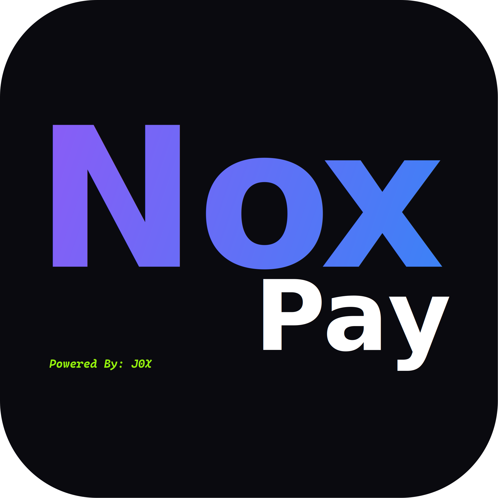
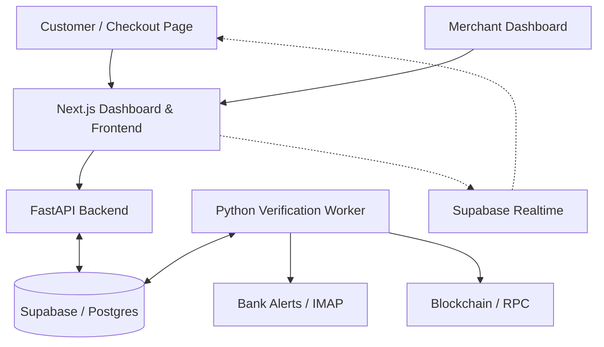
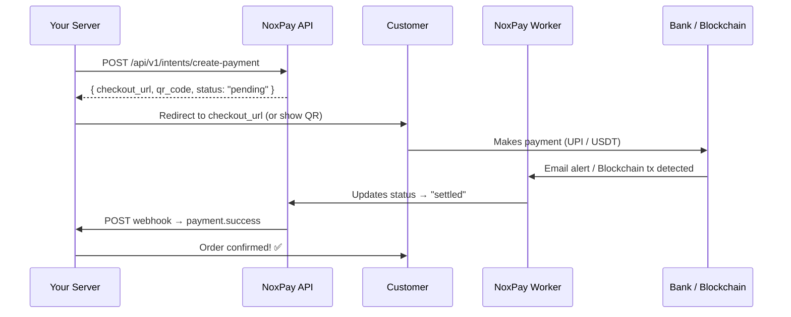

# 🌌 NoxPay
[](https://John-Varghese-EH.github.io/NoxPay/)
[](https://github.com/John-Varghese-EH/NoxPay)
<div align="center">
  
  <h3><b>The Ultimate Self-Hosted UPI & Crypto Payment Gateway</b></h3>
  <p>Eliminate middleman fees. Retain 100% of your revenue. Deploy your own payment infrastructure in minutes.</p>
  
  [](https://John-Varghese-EH.github.io/NoxPay/)
  [](https://vercel.com/)
  [](https://supabase.com/)
  [](https://nextjs.org/)
  [](https://fastapi.tiangolo.org/)
</div>

NoxPay is an open-source, self-hosted payment solution designed for Indian merchants and global businesses. Protect your sovereignty, minimize fees, and automate your settlement workflows for both UPI and Crypto.

---
> [!NOTE]
> **🚧 Work in Progress:**  
> This project is actively being developed! Contributions, feedback, and ideas are welcome.  
> *Star the repo and join the project!*
---

## 🏗️ Architecture

NoxPay is built with a distributed architecture to ensure scalability and security.



## 📁 Project Structure

| Folder | Description |
| :--- | :--- |
| `api/` | FastAPI backend handling payment intents, webhooks, and merchant logic. |
| `dashboard/` | Next.js frontend for merchants and the hosted checkout pages. |
| `worker/` | Python background worker that verifies transactions (UPI & Crypto). |
| `supabase/` | Database schema and migrations. |

---

## ⚡ Core Features

NoxPay is designed to give you the same high-end experience, but without the 3% transaction fees.

### 💳 Modern Checkout Experience
- **Live QR Codes**: Instant scannable UPI and Crypto QR codes generated on-the-fly.
- **Real-time Status Polling**: The checkout page automatically redirects to "Success" the moment funds are verified via websockets (Supabase Realtime).
- [x] **Live Expiry Timers**: Precise MM:SS countdowns on every checkout link to create urgency and ensure fresh pricing.
- [x] **Multi-Language Support**: One-click toggle between English and Hindi on checkout pages to reach a broader audience.
- [x] **Embeddable Widget**: A clean, iframe-optimized checkout flow (`/widget`) you can drop into any website.

### 🛠️ Merchant Dashboard
- **No-Code Payment Links**: Create and share checkouts instantly via a simple form. No API knowledge required.
- **Branding Live Preview**: See exactly how your checkout looks as you customize your brand color and logo on the Settings page.
- **Webhook Observability**: Track every webhook delivery, view response codes, and manually "Retry" failed deliveries with one click.
- **Persistent Webhook Retries**: Automatic background retry logic with exponential backoff for failed webhook deliveries.
- **Crypto Tab**: Dedicated space for tracking USDT (TRC20) and Crypto payments with a live transaction feed.
- **Transaction Metadata**: Attach custom JSON metadata to any payment intent, which is preserved throughout the payment lifecycle and included in webhooks.

---

## 🔒 Security Infrastructure

Security isn't an afterthought; it's the foundation of NoxPay.

- **HMAC-SHA256 Webhooks**: Every webhook is cryptographically signed. NoxPay uses a dedicated `webhook_secret` distinct from your API keys.
- **Replay Protection**: Timestamps are included in all signatures to prevent payload interception and re-use.
- **bcrypt API Secrets**: Your Client Secrets are hashed using industry-standard bcrypt. Even if the database is compromised, your secrets remain unreadable.
- **Row-Level Security (RLS)**: Every database query is restricted to the authenticated merchant at the Postgres level.
- **Identity Verification**: Background workers verify bank alerts against specific transaction notes to prevent UTR spoofing.

---

## 🎨 Professional Customization

NoxPay gives you total control over your brand identity:

1. **Brand Identity**: Upload your logo and set your primary theme color.
2. **Interactive Preview**: Use the real-time preview widget in Settings to see your branding across Desktop and Mobile views instantly.
3. **Theme Presets**: Choose from curated professional palettes like *Midnight Blue, Emerald Green, or Rose Crush*.
4. **Custom Return URLs**: Define exactly where users go after a successful payment attempt.

---

## 🌍 International Payments (Crypto)

**Can I accept international payments for free?**
Yes. Traditional gateways (Stripe/PayPal) charge 4-7% for international transactions. NoxPay solves this via **USDT (Crypto) Integration**.

- **Sovereign Settlement**: By using the USDT (TRC20) payment method in NoxPay, you can accept payments from anyone, anywhere in the world, instantly.
- **$0 Gateway Fees**: You pay zero percentage to NoxPay. You only deal with standard blockchain network gas fees (usually <$1).
- **Zero Chargebacks**: Unlike credit cards, crypto payments are final, protecting you from international fraud and disputes.

---

## 🛠️ Complete Setup Guide

This guide walks you through deploying NoxPay from scratch - **database → dashboard → API → worker** - entirely on free tiers.

### 📋 Prerequisites
- **Node.js** (v18+) & **npm**
- **Python** (v3.9+) & **pip**
- A **GitHub** account
- A **Supabase** account ([supabase.com](https://supabase.com) - Free tier)
- A **Vercel** account ([vercel.com](https://vercel.com) - Free tier)
- A **Render** account ([render.com](https://render.com) - Free tier)

---

### Step 1: Set Up Supabase (Database)

1. Go to [supabase.com](https://supabase.com) → **New Project**.
2. Note down these values (you'll need them later):

   | Value | Where to Find |
   | :--- | :--- |
   | `SUPABASE_URL` | Settings → API → Project URL |
   | `SUPABASE_KEY` (Service Role) | Settings → API → `service_role` key (⚠️ keep secret!) |
   | `NEXT_PUBLIC_SUPABASE_ANON_KEY` | Settings → API → `anon` public key |

3. **Create the database schema** - Go to **SQL Editor** → **New Query** and paste the contents of [`supabase/schema.sql`](supabase/schema.sql), then click **Run**.

4. **Enable Realtime** - Go to **Database → Replication** and enable Realtime for the `payment_intents` table (this powers live checkout status updates).

---

### Step 2: Deploy Dashboard + API on Vercel

NoxPay's `vercel.json` is preconfigured to deploy the Next.js dashboard and FastAPI backend as a single project.

#### Option A: One-Click Deploy

[](https://vercel.com/new/clone?repository-url=https%3A%2F%2Fgithub.com%2FJohn-Varghese-EH%2FNoxPay)

#### Option B: Manual Deploy

1. **Fork** this repo to your GitHub account.
2. Go to [vercel.com/new](https://vercel.com/new) → Import your forked `NoxPay` repo.
3. Vercel auto-detects the monorepo structure via `vercel.json`.
4. Click **Deploy** (initial deploy will fail - that's OK, we need env vars first).

#### Configure Environment Variables

In Vercel → Your Project → **Settings → Environment Variables**, add:

| Variable | Value | Notes |
| :--- | :--- | :--- |
| `SUPABASE_URL` | `https://xxx.supabase.co` | From Step 1 |
| `SUPABASE_KEY` | `eyJ...` (Service Role key) | ⚠️ Keep secret |
| `NEXT_PUBLIC_SUPABASE_URL` | `https://xxx.supabase.co` | Same as SUPABASE_URL |
| `NEXT_PUBLIC_SUPABASE_ANON_KEY` | `eyJ...` (anon key) | Public, safe for frontend |
| `AUTH_PASSWORD` | Any strong password | Dashboard login password |
| `MASTER_API_KEY` | Random 64-char hex string | Generate with `openssl rand -hex 32` |
| `ALLOWED_ORIGINS` | `https://your-project.vercel.app` | Your Vercel domain |

5. After adding all variables → **Deployments → Redeploy** the latest deployment.
6. Your dashboard is now live at `https://your-project.vercel.app` 🎉

#### How Vercel Routing Works

```
your-project.vercel.app/           → Next.js Dashboard (merchant panel + checkout)
your-project.vercel.app/api/*      → FastAPI Backend (payment intents, webhooks)
your-project.vercel.app/checkout   → Hosted checkout page (customer-facing)
your-project.vercel.app/widget     → Embeddable iframe widget
```

---

### Step 3: Deploy Worker on Render (Free)

The **worker** is a long-running Python process that monitors bank emails (IMAP) and blockchain transactions to auto-verify payments. It needs an always-on host - Render's free tier is an excellent host for this.

#### 3a. Create a Render Account

1. Go to [render.com](https://render.com) and sign up.
2. Connect your **GitHub** account when prompted.

#### 3b. Create a New Background Worker

1. Click **New +** → Select **Background Worker**.
2. Choose your `NoxPay` repository.
3. Configure the service:

   | Setting | Value |
   | :--- | :--- |
   | **Name** | `noxpay-worker` |
   | **Branch** | `main` |
   | **Runtime** | `Python 3` |
   | **Build Command** | `pip install -r worker/requirements.txt` |
   | **Start Command** | `python worker/main.py` |
   | **Instance Type** | `Free` |
   | **Region** | Choose nearest to your bank |

4. **Override the Run Command** to:
   ```
   python worker/main.py
   ```

#### 3c. Set Environment Variables

In the **Environment** section, add the following variables:

| Variable | Value | Notes |
| :--- | :--- | :--- |
| `SUPABASE_URL` | `https://xxx.supabase.co` | Same as Vercel |
| `SUPABASE_KEY` | `eyJ...` (Service Role key) | Same as Vercel |
| `IMAP_SERVER` | `imap.gmail.com` | Your email provider's IMAP server |
| `IMAP_PORT` | `993` | Standard IMAP SSL port |
| `IMAP_USER` | `your-bank-email@gmail.com` | Email receiving bank alerts |
| `IMAP_PASSWORD` | `xxxx xxxx xxxx xxxx` | Gmail App Password (see below) |
| `USDT_WATCH_ADDRESS` | `T...` (your TRC20 address) | Optional: for crypto payments |
| `TRON_RPC_URL` | `https://api.trongrid.io` | Optional: Tron RPC endpoint |

#### 3d. Gmail App Password Setup

If using Gmail for bank alert forwarding:

1. Go to [myaccount.google.com/apppasswords](https://myaccount.google.com/apppasswords).
2. Select **Mail** → **Other** → name it `NoxPay Worker`.
3. Copy the 16-character password → use it as `IMAP_PASSWORD`.

> **Note**: You must have **2-Factor Authentication** enabled on your Google account to generate App Passwords.

#### 3e. Deploy

Click **Create Background Worker** → Render installs dependencies and starts the worker. Check the **Logs** tab to verify:

```
Starting NoxPay Worker 🚀
Connecting to IMAP imap.gmail.com...
IMAP Logged in. Watching for SEEN=False messages...
Entering IDLE loop...
```

---

### Step 4: Configure Bank Email Alerts

For the worker to auto-verify payments, your bank must send email alerts for every transaction. See the detailed instructions in [`BANK_CONFIGURATION.md`](BANK_CONFIGURATION.md) for supported banks.

**Quick summary**: Enable email alerts on your bank account → set the threshold to **₹1 / $0.01** → forward alerts to the Gmail address used in Step 3.

---

### 💻 Local Development

For local development, use the automated setup script:

```bash
git clone https://github.com/John-Varghese-EH/NoxPay.git
cd NoxPay
chmod +x setup.sh
./setup.sh
```

This generates `.env` files for all three components. Then start each in a separate terminal:

```bash
# Terminal 1 - Dashboard
cd dashboard && npm install && npm run dev

# Terminal 2 - API
cd api && pip install -r requirements.txt && uvicorn main:app --reload --port 8000

# Terminal 3 - Worker
cd worker && pip install -r requirements.txt && python main.py
```

Your local instance runs at `http://localhost:3000`.

---

## ⚙️ Environment Variables Reference

### Dashboard (`dashboard/.env.local`)

| Variable | Required | Description |
| :--- | :--- | :--- |
| `NEXT_PUBLIC_SUPABASE_URL` | ✅ | Supabase project URL (public) |
| `NEXT_PUBLIC_SUPABASE_ANON_KEY` | ✅ | Supabase anonymous key (public) |
| `SUPABASE_SERVICE_ROLE_KEY` | ✅ | Supabase service role key (server-side only) |
| `AUTH_PASSWORD` | ✅ | Password to access the merchant dashboard |
| `MASTER_API_KEY` | ✅ | Secret key for dashboard ↔ API communication |
| `NEXT_PUBLIC_APP_URL` | ❌ | Base URL override (defaults to Vercel domain) |

### API (`api/.env`)

| Variable | Required | Description |
| :--- | :--- | :--- |
| `SUPABASE_URL` | ✅ | Supabase project URL |
| `SUPABASE_KEY` | ✅ | Supabase service role key |
| `MASTER_API_KEY` | ✅ | Must match the dashboard's MASTER_API_KEY |
| `ALLOWED_ORIGINS` | ✅ | Comma-separated CORS origins (e.g. `https://yourdomain.com`) |
| `JWT_SECRET` | ❌ | JWT signing secret (auto-generated by `setup.sh`) |

### Worker (`worker/.env`)

| Variable | Required | Description |
| :--- | :--- | :--- |
| `SUPABASE_URL` | ✅ | Supabase project URL |
| `SUPABASE_KEY` | ✅ | Supabase service role key |
| `IMAP_SERVER` | ✅ | Email IMAP server (e.g. `imap.gmail.com`) |
| `IMAP_PORT` | ❌ | IMAP port (default: `993`) |
| `IMAP_USER` | ✅ | Email address for bank alerts |
| `IMAP_PASSWORD` | ✅ | Email app password |
| `USDT_WATCH_ADDRESS` | ❌ | TRC20 wallet address to monitor for USDT payments |
| `TRON_RPC_URL` | ❌ | Tron RPC endpoint (default: `https://api.trongrid.io`) |
| `SOLANA_RPC_URL` | ❌ | Solana RPC endpoint |
| `SOLANA_WATCH_ADDRESS` | ❌ | Solana wallet to monitor |
| `POLYGON_RPC_URL` | ❌ | Polygon RPC endpoint |
| `POLYGON_WATCH_ADDRESS` | ❌ | Polygon wallet to monitor |
| `POLL_INTERVAL` | ❌ | Blockchain polling interval in seconds (default: `5`) |

---

## 🚀 Deployment Summary

| Component | Platform | Cost | Always-On? |
| :--- | :--- | :--- | :--- |
| **Dashboard + API** | [Vercel](https://vercel.com) | Free | ✅ Serverless |
| **Worker** | [Render](https://render.com) | Free | ✅ No sleep |
| **Database** | [Supabase](https://supabase.com) | Free | ✅ Always-on |

> For more deployment options (Render, Oracle Cloud, Fly.io, etc.), see [`deployment_guide.md`](deployment_guide.md).

---

## 📈 Merchant / Developer Integration Guide

Once NoxPay is deployed, you (or your merchants) can integrate payments via the REST API. Here's the complete flow:

### Authentication

Every API request requires two headers:

| Header | Value | Description |
| :--- | :--- | :--- |
| `X-Client-ID` | `your-client-uuid` | The merchant's Client ID (from dashboard) |
| `X-Client-Secret` | `sk_live_...` | The merchant's API secret (shown once at creation) |

---

### API Endpoints

| Method | Endpoint | Description |
| :--- | :--- | :--- |
| `POST` | `/api/v1/intents/create-payment` | Create a new payment intent |
| `GET` | `/api/v1/intents/{order_id}` | Check payment status |
| `POST` | `/api/v1/webhooks/test` | Send a test webhook |
| `GET` | `/api/v1/webhooks/logs` | View webhook delivery logs |
| `GET` | `/health` | API health check |

---

### Example 1: Create a UPI Payment (cURL)

```bash
curl -X POST https://your-nox-pay.vercel.app/api/v1/intents/create-payment \
  -H "X-Client-ID: a1b2c3d4-e5f6-7890-abcd-ef1234567890" \
  -H "X-Client-Secret: sk_live_secret" \
  -H "Content-Type: application/json" \
  -d '{
    "amount": 499.00,
    "currency": "UPI",
    "order_id": "ORDER_20240315_001",
    "metadata": {
      "customer_name": "Rahul Sharma",
      "product": "Premium Plan"
    }
  }'
```

**Response:**
```json
{
  "id": "f47ac10b-58cc-4372-a567-0e02b2c3d479",
  "order_id": "ORDER_20240315_001",
  "amount": 499.00,
  "currency": "UPI",
  "status": "pending",
  "payment_uri": "upi://pay?pa=merchant@sbi&pn=MyStore&am=499.00&tr=ORDER_20240315_001",
  "qr_code_base64": "data:image/png;base64,iVBORw0KGgo...",
  "checkout_url": "https://your-nox-pay.vercel.app/checkout?intent=f47ac10b-58cc-4372-a567-0e02b2c3d479",
  "metadata": { "customer_name": "Rahul Sharma", "product": "Premium Plan" },
  "expires_at": "2024-03-15T15:15:00.000Z"
}
```

You can either:
- **Redirect** the customer to the `checkout_url` (hosted checkout page)
- **Embed** the `qr_code_base64` directly in your own UI

---

### Example 2: Create a USDT Crypto Payment

```bash
curl -X POST https://your-nox-pay.vercel.app/api/v1/intents/create-payment \
  -H "X-Client-ID: <YOUR_CLIENT_ID>" \
  -H "X-Client-Secret: <YOUR_CLIENT_SECRET>" \
  -H "Content-Type: application/json" \
  -d '{
    "amount": 25.00,
    "currency": "USDT",
    "order_id": "INV_98765"
  }'
```

---

### Example 3: Python Integration

```python
import requests
import hmac
import hashlib
import json

NOXPAY_URL = "https://your-nox-pay.vercel.app"
CLIENT_ID = "your-client-uuid"
CLIENT_SECRET = "sk_live_your_secret_here"

# --- Create a payment ---
def create_payment(amount: float, order_id: str, currency: str = "UPI"):
    response = requests.post(
        f"{NOXPAY_URL}/api/v1/intents/create-payment",
        headers={
            "X-Client-ID": CLIENT_ID,
            "X-Client-Secret": CLIENT_SECRET,
            "Content-Type": "application/json",
        },
        json={
            "amount": amount,
            "currency": currency,
            "order_id": order_id,
            "metadata": {"source": "python-sdk"}
        },
    )
    response.raise_for_status()
    return response.json()

# --- Check payment status ---
def check_status(order_id: str):
    response = requests.get(
        f"{NOXPAY_URL}/api/v1/intents/{order_id}",
        headers={
            "X-Client-ID": CLIENT_ID,
            "X-Client-Secret": CLIENT_SECRET,
        },
    )
    response.raise_for_status()
    return response.json()

# --- Verify webhook signature ---
def verify_webhook(payload: bytes, signature: str, webhook_secret: str) -> bool:
    """Verify the X-NoxPay-Signature header on incoming webhooks."""
    expected = hmac.new(
        webhook_secret.encode(), payload, hashlib.sha256
    ).hexdigest()
    return hmac.compare_digest(expected, signature)

# Usage
payment = create_payment(amount=299.00, order_id="ORD_001")
print(f"Checkout URL: {payment['checkout_url']}")
print(f"QR Code available: {'qr_code_base64' in payment}")
```

---

### Example 4: Node.js / Express Integration

```javascript
const crypto = require("crypto");

const NOXPAY_URL = "https://your-nox-pay.vercel.app";
const CLIENT_ID = "your-client-uuid";
const CLIENT_SECRET = "sk_live_your_secret_here";
const WEBHOOK_SECRET = "whsec_your_webhook_secret";

// --- Create a payment intent ---
async function createPayment(amount, orderId, currency = "UPI") {
  const res = await fetch(`${NOXPAY_URL}/api/v1/intents/create-payment`, {
    method: "POST",
    headers: {
      "X-Client-ID": CLIENT_ID,
      "X-Client-Secret": CLIENT_SECRET,
      "Content-Type": "application/json",
    },
    body: JSON.stringify({ amount, currency, order_id: orderId }),
  });

  if (!res.ok) throw new Error(`NoxPay error: ${res.status}`);
  return res.json();
}

// --- Poll payment status ---
async function checkStatus(orderId) {
  const res = await fetch(`${NOXPAY_URL}/api/v1/intents/${orderId}`, {
    headers: {
      "X-Client-ID": CLIENT_ID,
      "X-Client-Secret": CLIENT_SECRET,
    },
  });
  return res.json();
}

// --- Express webhook handler ---
const express = require("express");
const app = express();
app.use(express.raw({ type: "application/json" }));

app.post("/webhooks/noxpay", (req, res) => {
  const signature = req.headers["x-noxpay-signature"];
  const expected = crypto
    .createHmac("sha256", WEBHOOK_SECRET)
    .update(req.body)
    .digest("hex");

  if (!crypto.timingSafeEqual(Buffer.from(signature), Buffer.from(expected))) {
    return res.status(401).json({ error: "Invalid signature" });
  }

  const event = JSON.parse(req.body);
  console.log("Payment verified:", event);

  // Update your order status in your database here
  res.status(200).json({ received: true });
});

app.listen(3001, () => console.log("Webhook server ready on :3001"));
```

---

### Example 5: PHP Integration

```php
<?php
$NOXPAY_URL    = "https://your-nox-pay.vercel.app";
$CLIENT_ID     = "your-client-uuid";
$CLIENT_SECRET = "sk_live_your_secret_here";

// --- Create a payment ---
function createPayment($amount, $orderId, $currency = "UPI") {
    global $NOXPAY_URL, $CLIENT_ID, $CLIENT_SECRET;

    $ch = curl_init("$NOXPAY_URL/api/v1/intents/create-payment");
    curl_setopt_array($ch, [
        CURLOPT_POST           => true,
        CURLOPT_RETURNTRANSFER => true,
        CURLOPT_HTTPHEADER     => [
            "X-Client-ID: $CLIENT_ID",
            "X-Client-Secret: $CLIENT_SECRET",
            "Content-Type: application/json",
        ],
        CURLOPT_POSTFIELDS => json_encode([
            "amount"   => $amount,
            "currency" => $currency,
            "order_id" => $orderId,
        ]),
    ]);

    $response = curl_exec($ch);
    curl_close($ch);
    return json_decode($response, true);
}

// --- Verify webhook ---
function verifyWebhook($payload, $signature, $webhookSecret) {
    $expected = hash_hmac("sha256", $payload, $webhookSecret);
    return hash_equals($expected, $signature);
}

// Usage
$payment = createPayment(150.00, "INV_12345");
echo "Redirect customer to: " . $payment["checkout_url"];
?>
```

---

### Webhook Events

When a payment is verified, NoxPay sends a `POST` request to your configured `webhook_url` with a signed payload:

```json
{
  "event": "payment.success",
  "data": {
    "id": "f47ac10b-58cc-4372-a567-0e02b2c3d479",
    "order_id": "ORDER_20240315_001",
    "amount": 499.00,
    "currency": "UPI",
    "status": "settled",
    "utr": "412345678901",
    "metadata": { "customer_name": "Rahul Sharma" }
  }
}
```

The `X-NoxPay-Signature` header contains an HMAC-SHA256 signature. **Always verify this signature** before processing the webhook - see the code examples above.

---

### Payment Flow Summary



---

<div align="center">
  
Crafted with ❤️ by **[John Varghese (J0X)](https://github.com/John-Varghese-EH)**  
*NoxPay is an open-source payment protocol. Use responsibly.*

[](https://buymeacoffee.com/CyberTrinity)
[](https://patreon.com/CyberTrinity)
[](https://github.com/sponsors/John-Varghese-EH)

</div>
